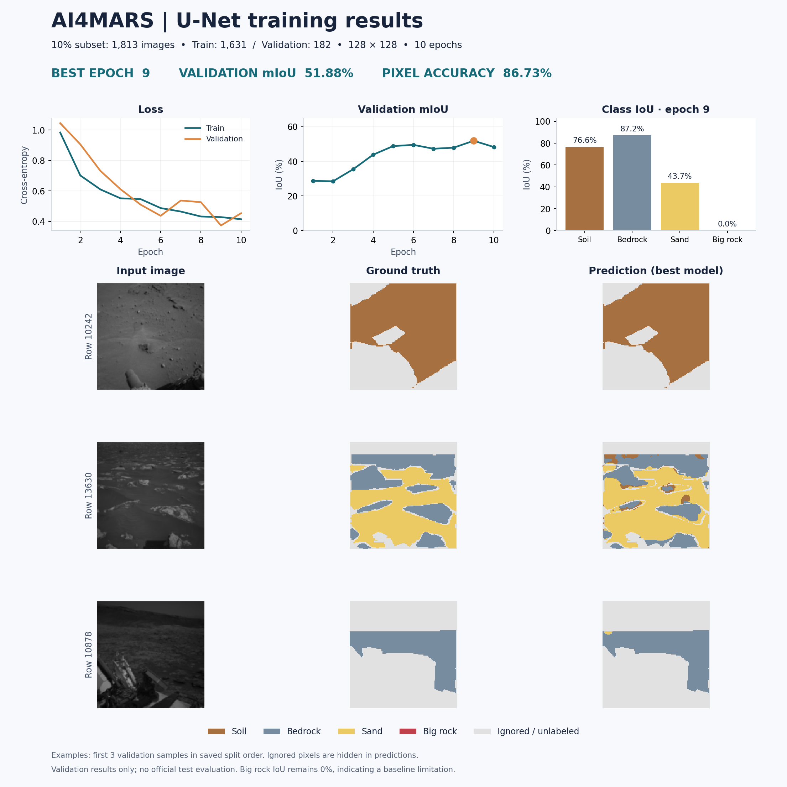

# ExcusezMars
This is the repo of team ExcusezMars for Mars City Hackathon - GirlWhoML x PhysicsX. Team member Julia Hong, data scientist/designer and Youran Song, 2D/3D designer.

## Mars terrain perception and rover demo

This repository contains the completed AI4MARS U-Net baseline, reproducible training artifacts, English result visualization, and a single-page Three.js rover geometry demo on real HiRISE terrain.

### Quick start: rover demo

```sh
python3 -m http.server 8000 --directory mars-rover-demo/dist
```

Open <http://localhost:8000>. Three.js and OrbitControls load from a CDN, so an internet connection is required. All browser logic and styles are in one HTML file; terrain and camera assets are local static files.

[Hosted demo (owner-private)](https://mars-rover-terrain-lab.finn-zhang626.chatgpt.site) · [Download demo bundle](mars-rover-demo.zip)

The demo includes six terrain-following wheels, adjustable diameter/width/wheel span, estimated contact pressure, sampled underbody clearance, perfect/model perception, missed-obstacle encounter counts, and real AI4MARS camera/prediction replay.

### Training result

| Setting / metric | Value |
| --- | --- |
| Original train split | 18,130 images |
| Eligible after label checks | 15,899 images |
| Selected subset | 1,813 images (10% of original split) |
| Train / validation | 1,631 / 182 |
| Input / training | 128 × 128, 10 epochs, seed 42 |
| Best checkpoint | Epoch 9 |
| Validation mIoU | 51.88% |
| Validation pixel accuracy | 86.73% |



These are validation results, not official test-set results. Big-rock IoU is 0%; the model does not predict that class. The small input resolution and short run are baseline limitations.

### Repository contents

| Path | Contents |
| --- | --- |
| `ai4mars_unet/` | Training, inference and visualization scripts |
| `ai4mars_unet/data/` | Exact sampled image/mask arrays, source revision and sample indices |
| `ai4mars_unet/run/` | Best and last checkpoints, configuration, metrics, example predictions, PNG/PDF report |
| `mars-rover-demo/dist/` | Single HTML demo plus DTM JSON/PNG, confusion matrix and camera assets |
| `mars-rover-demo/scripts/` | Python + rasterio asset preparation |
| `track-b-vehicles-ai4mars/` | Original supplied terrain pack and simulated logistics data |
| `Perseverance_Panorama_8k-2.jpg` | Original team repository panorama, preserved |

### Reproduce training and figures

Python 3.9 was used for the recorded run. The root requirements include rasterio for DTM processing; the training folder also records its earlier environment.

```sh
python3 -m venv .venv
.venv/bin/python -m pip install -r requirements.txt
.venv/bin/python ai4mars_unet/train.py
.venv/bin/python ai4mars_unet/visualize_results.py
.venv/bin/python ai4mars_unet/predict.py ai4mars_unet/run/example_input.png
```

The exact 1,813-image subset is included, so the default training run does not need the full source dataset. Training again overwrites `ai4mars_unet/run/`. If the subset is absent, preparation downloads approximately 6.1 GB of training shards. Changing the seed or image size generates a new subset.

### Rebuild DTM and perception assets

The processed 256 × 256 height JSON/PNG and measured confusion matrix are already included. To regenerate them, download the original DTM first:

```sh
curl -L --fail --retry 3 \
  'https://www.uahirise.org/PDS/DTM/PSP/ORB_009100_009199/PSP_009149_1750_PSP_009294_1750/DTEEC_009149_1750_009294_1750_U01.IMG' \
  -o ai4mars_unet/HiRISE_Gale.IMG
.venv/bin/python mars-rover-demo/scripts/prepare_assets.py
```

Original DTM (~391 MB), downloaded dataset shards and the virtual environment are intentionally excluded from Git. The two checkpoints and sampled data are included. The original Sites repository metadata is excluded from this GitHub copy; it is not needed to run the static demo.

### Interpretation and sources

- Terrain colors are slope-based simulated classes, with errors sampled from the measured validation confusion matrix. U-Net is **not applied directly to orbital imagery**.
- The grid is 1 m, resampled from approximately 1.012 m HiRISE pixels. Rocks smaller than 1 m are not represented.
- This is a **geometric demonstration, not a dynamics simulation**. Contact area assumes 20 mm indentation; the adjustable pressure threshold is illustrative. Obstacle encounters are proxies, not collision-force estimates.
- Navigation frames are real AI4MARS validation images with actual U-Net overlays, but are not geographically aligned with the DTM.
- [AI4MARS Hugging Face source](https://huggingface.co/datasets/hassanjbara/AI4MARS); exact source revision and selected row IDs are recorded in `ai4mars_unet/data/selection.json`.
- [HiRISE DTM: Gale Crater inverted riverbed](https://www.uahirise.org/dtm/dtm.php?ID=PSP_009149_1750), NASA/JPL-Caltech/University of Arizona. Product, crop and elevation metadata are in `terrain.json`.
- The original terrain pack includes synthetic dust frames and simulated logistics; see its `DATA_NOTES.txt`. It was not used as the training subset for this baseline.

See [training notes](ai4mars_unet/README.md) and [demo assumptions](mars-rover-demo/README.md) for details. Source data retain their respective attribution and usage terms; no new blanket license is asserted for third-party assets.
